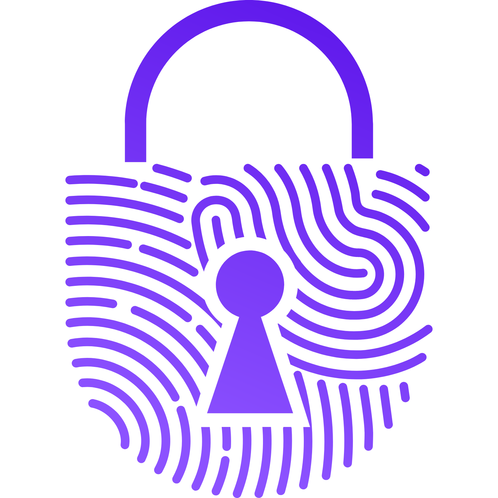

<p align="center">
  
</p>

<h1 align="center">SECURE VAULT - THE ONLY KEY IS YOU</h1>

<br>

**Secure Vault** is a privacy-focused application designed to safeguard your passwords, documents, and other confidential information. It's built with end-to-end encryption, ensuring that only you have access to your data. We never have access to your passwords or sensitive information. 

## ⚗️ Key Features:

* **End-to-End Encryption:** Your data is encrypted on your device and remains encrypted on our servers, ensuring only you can access it.  
* **Master Password Security:** Your master password is the only key to unlocking your vault. 
* **Secure Storage:** Keep all your valuable data safe and organized in one place.
* **Secure Sharing:**  Share your information securely with trusted individuals. 

## Why Choose Secure Vault?

* **Ultimate Privacy:** Your data is your business. We don't have access to it.
* **Peace of Mind:** Securely store and manage your most important information.
* **Easy to Use:**  A user-friendly interface makes it simple to manage your vault.
* **Open Source:**  We welcome community contributions to make Secure Vault even better.

## Repository Structure

This repository serves as the main hub for the Secure Vault project, containing links to the three independent repositories:

* [Secure Vault Server](https://github.com/puneetkakkar/secure-vault-server) - Backend service built with Java & Spring Boot.

* [Secure Vault Web](https://github.com/puneetkakkar/secure-vault-web) - Web-based frontend built with React.js.

* [Secure Vault Mobile](https://github.com/puneetkakkar/secure-vault-mobile) - Mobile application built with React Native.

Each repository operates independently for better maintainability and modularity.

## Getting Started:

To set up and run the Secure Vault application, navigate to the respective repository and follow the installation steps outlined in its README file.

**Cloning All Repositories:**
If you wish to clone all repositories together, run:

```bash
# Clone the main repository
git clone https://github.com/puneetkakkar/secure-vault
cd secure-vault

# Clone submodules (each component)
git submodule update --init --recursive
```
Alternatively, you can navigate to each repository and clone them individually.

## Contributing

We encourage you to contribute to Secure Vault's development!

* **Report issues:** Find a bug or have a suggestion. Please submit an issue on GitHub.
* **Submit pull requests:**  Want to add a feature or fix a bug? Submit a pull request to our repository.
* **Join the community:**  Connect with other developers.

**Before contributing:**

* Please read our [Contributing Guidelines](CONTRIBUTING.md) for a detailed guide.
* Ensure you have signed our Contributor License Agreement (CLA). 

## License

This project is licensed under the [License Name] License - see the [LICENSE](LICENSE) file for details.

**Together, let's make Secure Vault the ultimate solution for protecting your digital secrets!**